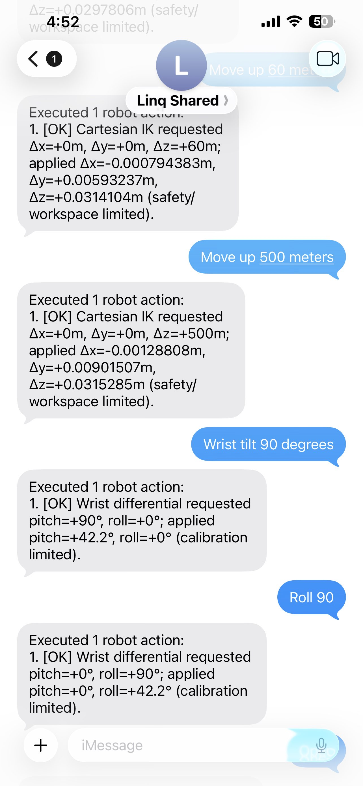

# Linqbot

When autonomy needs a human, take over with your hands through AR glasses or iMessage texts/voice diction.

**Linq + Luna planning • Xreal One Pro teleop • LeRobot SO-101**

---

## Features

### iMessage Robot Agent
Send a natural-language request. Linq delivers it, Runware GPT-5.6 Luna plans an ordered tool sequence, the arm executes step-by-step, and you get a deterministic result reply.

<p align="center">
  
</p>

<!-- Optional full video: drop docs/assets/imessage-agent-demo.mp4 and uncomment below
<p align="center">
  <video src="docs/assets/imessage-agent-demo.mp4" controls width="260"></video>
</p>
-->

### Leader / Driver Arm Teleop
Drive the follower SO-101 by moving a calibrated leader (driver) arm — joint-for-joint teleop with optional recording and replay for demos and datasets.

<!--
<p align="center">
  
</p>
-->

<!-- Optional full video: drop docs/assets/leader-arm-teleop-demo.mp4 and uncomment below
<p align="center">
  <video src="docs/assets/leader-arm-teleop-demo.mp4" controls width="260"></video>
</p>
-->

### Automated Arm
The agent runs a planned tool sequence end-to-end — no leader arm, no hand tracking — just Luna’s ordered calls executing on the follower.

<p align="center">
  
</p>

<!-- Optional full video: drop docs/assets/automated-arm-demo.mp4 and uncomment below
<p align="center">
  <video src="docs/assets/automated-arm-demo.mp4" controls width="260"></video>
</p>
-->

### Failure & Recovery
When a step fails (missed grasp, workspace clamp, tool error), execution stops, Linq reports the failure, and a human can take over.

<p align="center">
  
</p>

<!-- Optional full video: drop docs/assets/failure-demo.mp4 and uncomment below
<p align="center">
  <video src="docs/assets/failure-demo.mp4" controls width="260"></video>
</p>
-->

### Deterministic Tool Execution
One message can produce many ordered calls. Execution stops on the first failure. Retrace plans invert Cartesian and wrist moves in reverse order; gripper state changes only when you ask for them.

| Tool | Purpose |
|---|---|
| `move_cartesian` | Differential XYZ through IK (`+x` right, `+y` forward, `+z` up) |
| `move_wrist` | Differential wrist pitch / roll (`±160°`) |
| `set_gripper` | Open or close the calibrated gripper |
| `hold_position` | Stop and hold the current pose |

<!--
<p align="center">
  
</p>
-->

---

## How It's Made

| Layer | Stack |
|---|---|
| Agent | FastAPI, Linq (iMessage), Runware GPT-5.6 Luna, LangGraph |
| Robot | MediaPipe, ikpy, LeRobot SO-101, OpenCV |
| Hardware | Xreal One Pro + Eye camera, Feetech STS3215 servos |
| Transport | Linq webhooks + LocalTunnel (public HTTPS) |

```text
iMessage
  → Linq webhook
  → FastAPI service
  → one Runware planning call
  → ordered robot tool calls
  → deterministic result formatter
  → iMessage reply

Xreal Eye Camera
  → Hand Tracking (MediaPipe)
  → Gesture / Clutch
  → Hand-to-EE Mapping
  → IK (ikpy)
  → SO-101 commands + glasses HUD
```

---

## Project Status

### To-Do
- [ ] Terac human-approval gate before any robot motion
- [ ] High-level autonomy tools (navigate, find, pick, drop)
- [ ] Failure escalation → remote AR hand-tracking recovery
- [ ] Control-mode arbiter (Planning → Autonomous → Human Control)
- [ ] Mobile base + end-to-end factory demo loop
- [ ] Automated testing pipeline

### Finished
- [x] Linq `message.received` webhook → FastAPI agent service
- [x] Runware Luna planning into ordered, explicit robot tool sequences
- [x] Deterministic iMessage replies from structured tool results
- [x] SO-101 hardware adapter with workspace / safety clamps
- [x] Xreal Eye grayscale stream + MediaPipe hand tracking
- [x] Fist clutch, pinch gripper, relative teleop (no snap on resume)
- [x] IK solver + live status overlay on the glasses
- [x] Webcam fallback path for development without the Eye camera

---

## Lessons Learned

Our team gained valuable experience in:

- Wiring a messaging channel (Linq) into a safe, tool-only robot control loop
- Keeping LLMs in the planner role — never authoring outbound operator text
- Building AR teleop on a reverse-engineered Eye camera stream under hackathon constraints
- Separating autonomy, approval, and human recovery so control ownership stays exclusive
- Project management and hardware + software debugging in a short hackathon window

---

## How to Run

### Requirements

Before you begin, ensure you have:

- Python 3 and pip
- Node.js / npm (for LocalTunnel)
- [Linq CLI](https://docs.linq.com) (webhook + API key management)
- Optional hardware: LeRobot SO-101, Xreal One Pro + Eye (Nebula beta, Spatial Anchor on)

### Step 1: Install dependencies

```bash
# From repo root
python3 -m venv .venv
source .venv/bin/activate   # Windows: .venv\Scripts\activate
pip install -r requirements.txt

# Or install packages separately
pip install -r agent/requirements.txt
pip install -r robot/requirements.txt
pip install lerobot   # SO-101 SDK; install from source if needed
```

Download MediaPipe models for teleop:

```bash
cd robot
bash scripts/download_models.sh
```

### Step 2: Configure the agent

```bash
cp agent/.env.example agent/.env
# Fill LINQ_API_KEY, RUNWARE_API_KEY, and (when using hardware) ROBOT_*
```

Calibrate the arm before first hardware use:

```bash
lerobot-calibrate --robot.type=so101_follower --robot.port=COM5 --robot.id=follower
```

### Step 3: Run the iMessage agent

```bash
cd agent
PYTHONPATH=src python -m demo.main
```

In another terminal, expose the webhook:

```bash
npx --yes localtunnel --port 8000
```

Set `PUBLIC_BASE_URL` to the tunnel HTTPS origin and point a Linq `message.received` webhook at:

```text
https://<tunnel>/webhooks/linq?version=2026-02-03
```

Health check:

```bash
curl http://localhost:8000/health
```

Full tunnel / Linq checklist: [docs/first-test-demo/setup-runbook.md](docs/first-test-demo/setup-runbook.md)

### Step 4: Run AR teleop (optional)

```bash
cd robot
python scripts/test_hand_tracking.py          # Eye + landmarks first
python -m src.main --port COM5                # full teleop pipeline
# python -m src.main --use-webcam             # USB webcam fallback
```

| Gesture | Action |
|---|---|
| Open hand | Track → move arm |
| Pinch (thumb + index) | Close gripper |
| Closed fist | **Clutch** — freeze arm, reposition freely |
| Release fist | Resume relative to current pose |

---

## Project Layout

```text
soma-hackathon/
├── agent/          # Linq webhook → Luna planner → robot tools
├── robot/          # Xreal Eye hand-tracking teleop for SO-101
├── docs/           # Demo runbook, product plan, feature briefs
│   └── assets/     # README GIFs / videos (drop media here)
├── datasets/       # Recorded teleop / replay data
└── vendor/         # Eye stream toolkit + early teleop prototypes
```

Deeper docs:

- [Agent README](agent/README.md)
- [Robot README](robot/README.md)
- [First test demo](docs/first-test-demo.md)
- [Future product plan (Terac)](docs/future-product-plan.md)

---